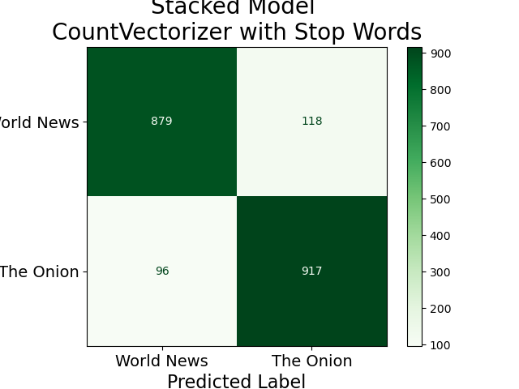
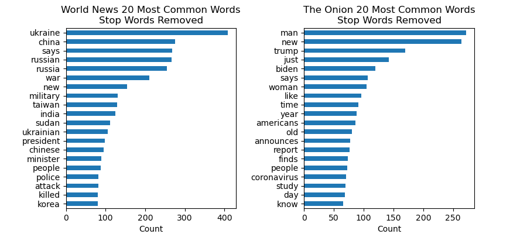

# Project 3 - 'Wait, was that a joke?' - Language Model Identification of Absurdist Humor and Satire
## Daniel Rossetti, Data Scientis for College University English Department

# 1. Problem Statement
This project is conducted from the standpoint of a data scientist hired by a university researching the relatability of AI chat bots and their ability to identify nuances of human language, particularly humor.  Some statements are considered funny, but are not necessarily presented as a joke.  The task is to come up with a language model that can identify humorous strings of text which are not structed in the format of a joke but are of similar structure to factual information.  Text must sourced to train and test a model which can differentiate between humorous and non-humorous statements.

**Can an NLP classification model be trained to recognize satire or absurdist humor?**

# 2. Project Approach
The Onion is a satirical news organization which produces news titles and news stories often relevant to real, current events that are satirical or would otherwise be classified as absurdist humor.  For clarity **news articles and titles from The Onion are not real.**  The tiles are however, formated in the format of actual news titles and articles which, from legitimate news agencies - are not humorous.

Comparing the titles of posts to the subreddit r/TheOnion against the subreddit r/worldnews (which posts news stories from actual news agencies) provides a way to compare strings of text which share many of the same formatting characteristics, but have completely different goals with respect to humor.

## 2.1 - High-level Steps
* Data Collection: Article titles from the World News and The Onion subreddits were collected
* Data Cleaning:  Titles were cleaned or removed as necessary to remove illegitimate titles and errors 
* Initial Modeling:  Some simple ensemble models were run to veryify model operability on the cleaned data
* Second-round Data Cleaning:  Information in titles that would confuse the model or make the titles easily identifiable were removed
* Exploratory Data Analysis:   
* Final Modeling:  Several models were run, a subset of those were optimized and then input into a borader ensemble model

## 2.2 - Code Notebooks
There are four code notbooks for this project described below:
* 1-Data_Collection' - Collects the data as described below, outputs it to one .csv file per subreddit
* '2-Data_Cleaning_Processing' - Imports that data from the previous notebook, performs initial data cleaning, and outputs the cleaned data to a .csv file
* '3 Initial-Model0Additional-Processing' - Runs initial models to verify operability, performs second round data cleaning, and outputs the data to a .csv file
* '4-Modeling-Round-2' - Performs final modeling and reports conclusions, discussions, and next steps

# 3 - Description of Data
Data were sourced using the Pushsiift API ([link](https://github.com/pushshift/api)) for the [r/TheOnion](https://www.reddit.com/r/TheOnion/) and [r/worldnews](https://www.reddit.com/r/worldnews/) subreddits.

A detailed description of the data collection and processing, and generated datasets can be found in the Appendix.  Accross the first three notebooks, a modeling and holdout dataset from each subreddit were collected and then cleaned and combined into modeling and holdout datasets containting the processed data for both subreddits.  They are explained here:
* Modeling Dataset - Used to train the models and create a testing dataset which is referenced as a benchmark for continuous model improvement
    * Approximately* 10367 titles were collected in total
* Holdout Dataset - Treated as 'unseen data' not examined during any processing or EDA steps and 'Held out' until the modeling phase.  Decisions on modeling optimization however are model solely with the performance of the testing data to prevent data leakage.  Model performance on the holdout dataset at each modeling step is only reported for informative purposes
    * Apprximately* 1730 titles were collected
\*See Appendix for explanation

#### Note Regarding Data Cleaning and Processing:
Steps were taken to remvoed illegitimate subreddit post titles and stip post titles of all information that was not parts of the true article title (ex. emojis) or would be uniquely identifying to the subreddit (ex. news agency names).

# 4 - Model Performance
Models were evaluated on their accuracy in corectly identifying articles for each subreddit.  As neither false negatives nor false positives are of particulr importance in an academic setting, examining only the accuracy when selcting th emodel is appropriate.

Seven classification models were run on the modeling dataset with article titles as the input data and the subreddits as the target.  Only thhe default paraemters were specified, and the goal of this step was to determine which classifiers were providing the best intial performance and had the potential to produce the best models with the highest accuracies. Two word vectorizers - CountVectorizer and TFIDFVectorizer - were both run with and without english stop words on all seven models.  Three combinations of models and word vectorizers were selected based on the accuracies produced with accuracies in predicting the test dataset between 86.7% and 88.5%.  All other models produced accuracies ranging from 76.5% to 85.2%.  The selected models/vecorizers here:
* Logistic Regression using CountVectorizer with stop words included
* Random Forest Classifier using CountVectorizer with stop words removed
* Extra Trees Classifier using CountVectorizer with stop words included

Each of these models were then optimized with hyperparameter tuning.  Surprisingly, the best model accuracies were generally produced with default model settings.  The logistic regression model was slightly improved by changing settings.  The results of the optimized models will be shown in the table below.

Finally, stacking regressor was used to combine the three models above as level 1 estimators which would create predictions which are features in a second and final estimator logistic regression model.  This stacked model, achieved the higest performance of all models with a slight improvement over the optimized logistic regression model.  The accuracy results are shown below for the stacking and optmized models for all datasets.

|                                    | Training Accuracy | Testing Accuracy | Holdout Accuracy |
|-----------------------------------:|------------------:|-----------------:|-----------------:|
|      Optimized Logistic Regression |          0.999751 |         0.891045 |         0.859873 |
| Optimized Random Forest Classifier |          1.000000 |         0.866667 |         0.826288 |
|   Optimized Extra Trees Classifier |          1.000000 |         0.879104 |         0.843080 |
|                Stacking Classifier |          0.999876 |         0.893532 |         0.860452 |

The confusion matrix for the stacked model is shown below against the testing data (note, this image was exported with errors and is slightly cropped): 

# 5 - Abridged Discussion of Results
While the model did produce very good results for a 'bag or words' model it is likely sucessful in classifying article titles due to the subject-matter discussed in each of the subreddits.  The image bellow shows the word counts (producedd by CountVectorizer) with stop words (ex. 'a', 'and', 'the', 'in', etc.) removed.  It can be seen that the most popular words refelct drastically different subjects.

This difference is liekly due to the fact that the data for each subreddit cover very different spans of time with totally different world and domestic events. Additionally, The Onion is largely U.S. focused while World News purports to have a glbal focus.

Very likely, the model is NOT able to understand or truly identify satire or absurdist humor based on word content alone.  However, word content is the first key to understanding such humor, and this model does provide some inital value despite lacking the ability to process the context of the statement and the world-knowledge required to understand humor that humans take for granted.

# 6 - Summary
* Seven common clissification models were run to determine which models would produce the best performance as measured by accuracy.  
* Three models, logistic regression, extra trees classifier, and a randomforest classifier, were then selected to be optimized.  
* With the excpetion of the logisitc regression model, all models performed better with their initial defualt parameters than after the optimization measures explored.  
* The three optimized models were then input into a stacking calssifier which cobined their outputs to create new feaures that a final logistic regression model would then create predicitons against.

# 7 - Conclusions
* The best performing model was a stacking classifier running optimized logistic regression, random forest, and extra trees models with a logistic regression final estimator
* The stacking regressor was overfit just as all highly accuracte models were
* The stacking classifier produced accuracies of:
    * 99.99% on the training data
    * 89.4% on the testing data
    * 86.0% on the unseen holdout data
* WIth the holdoutdata, this model suggest comparable performance on additional unseen data

**With this, it is possible to create a model which will at least discern between article titles from the World News and The Onion subreddits.  However, capability of the model to truly understnd satire or absurdist humor has yet to be determined, but is unlikely due to the relative simplicity of the model.**

# 8 - Next Steps
* Subjectivity analysis should be performed for each statement to determine if there is any value to adding this feature to a model
* Other sources of satire should be selected where the subject matter is more identical
* Alternatively, World News and Onion article titles could be carefully source from more comparable time periods
* Examine feature importances for the tree-models and coefficients for the logistic regression models to understand which features in the model have the gratest impact
    * This will likely provide insight into exactly how the models are working

---
# APPENDIX:
## Data Collection:  Notebook 1
* Approximately 6,000 titles were sourced from both The Onion and World News, going backwards chronologically from April 24, 2023 until the stated number of posts had been collected
* Due to the activity of the World news versus The Onion subreddits, data for World News extends back only to April 5, 2023, while data for The Onion goes all the way back to January 3 of 2020
This notebook outputs one .csv file for each subreddit containing all information available from the Pushshift API with the name of the subreddit and the epoch time that it was collected in the file name.

A holdout dataset with approximately 1000 samples for each subreddit is also created with the same file name format.

## Cleaned Data:  Notebook 2
Each of these datasets are processed and combined into a single notbook with only the subreddit name and the post titles.  There are approximately 10,367 samples in this dataset; 'approximately' due to the fact that each time this notebook is run, one of the cleaning procedures producs slightly different results and removes a sligtly different number of samples.  This data is output into a .csv called 'reddit_clean.csv'

The holdout dataset contained approximately 1730 datapoints when fully cleaned and processed.

## Second Round Cleaned Data: Notebook 3
The previous dataset is then processed further and output to a .csv called 'reddit_clean_2'.  A funciton in this notebook then cleans and processes the holdout dataset (in the same manner as this and previous notebook) which is output to 'reddit_holdout_2.csv'.  Both datasets contain only the subreddit names and post titles.  This final step produces the fully cleaned and processed modeling and holdout datasets used for final modeling.